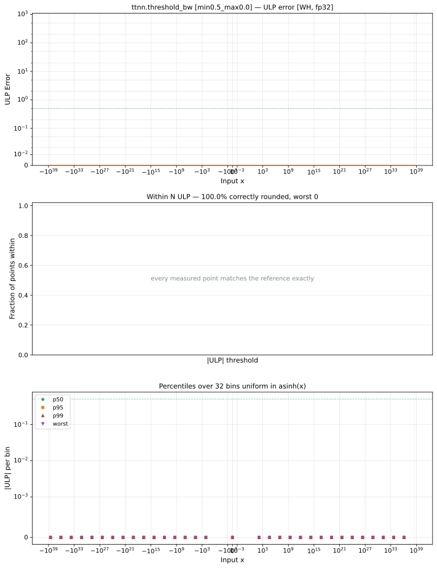

# threshold_bw — Wormhole (WH), float32
_This page is auto-generated by `ttnn-accuracy report`. Do not edit manually._

**Architecture:** Wormhole (WH)  
**Data type:** float32  

---

[← Wormhole (WH) float32 ops](README.md) | [All archs for threshold_bw](../../../by_op/threshold_bw/README.md) | [Top](../../../README.md)

**Measured input range:** x ∈ [-3.403e+38, 3.403e+38]  

|  | `min=0.5,max=0.0` |
|---|---|
| Max ULP | 0 |
| Min ULP | 0 |
| Mean ULP | 0 |
| Signed bias (ULP) | 0 |
| p50 ULP | 0 |
| p95 ULP | 0 |
| p99 ULP | 0 |
| Exact fraction | 1 |
| Correctly rounded | 1 |
| Accurate to \|x\| | 3.39e+38 |
| Max abs error | 0 |
| Max rel error | 0 |
| Median rel error | 0 |
| Bits of precision (worst) | — |
| Bits of precision (median) | — |

**min=0.5,max=0.0** — bit-exact · _ttnn binds threshold and value as min/max; the golden's *args are unbindable_  

**Outcomes**

| Parameters | exact |
|---|---|
| `min=0.5,max=0.0` | 65,024 |

**Monotonicity**

_Checked only where the reference is itself ordered, and never across a discontinuity._

| Parameters | Pairs | Violations | Rate | Worst \|Δy\| |
|---|---|---|---|---|
| `min=0.5,max=0.0` | 65,022 | 0 | 0 | 0 |

### Special values

| Variant | x | device | golden |  |
|---|---|---|---|---|
| `min=0.5,max=0.0` | 0 | 0 | 0 | agree |
| `min=0.5,max=0.0` | -0 | 0 | 0 | agree |
| `min=0.5,max=0.0` | inf | 1 | 1 | agree |
| `min=0.5,max=0.0` | -inf | 0 | 0 | agree |
| `min=0.5,max=0.0` | nan | 0 | 0 | agree |
| `min=0.5,max=0.0` | 1.1754944e-38 | 0 | 0 | agree |
| `min=0.5,max=0.0` | -1.1754944e-38 | 0 | 0 | agree |

_Measured on WORMHOLE_B0 · tt-metal `de546d3b146` · ttnn `0.79.0` · run `20261003T030514`_

