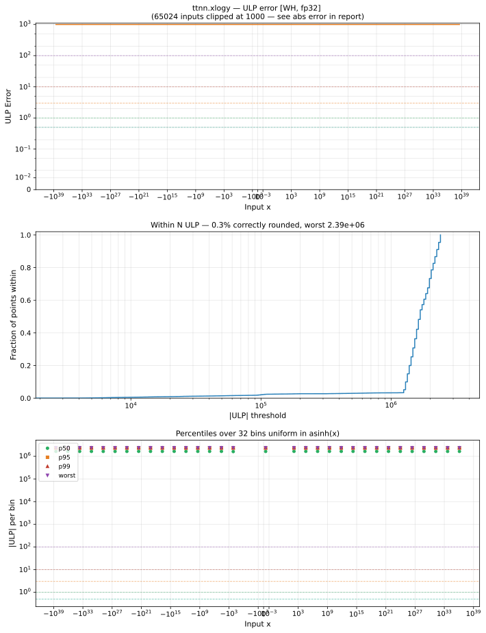

# xlogy — Wormhole (WH), float32
_This page is auto-generated by `ttnn-accuracy report`. Do not edit manually._

**Architecture:** Wormhole (WH)  
**Data type:** float32  

---

[← Wormhole (WH) float32 ops](README.md) | [All archs for xlogy](../../../by_op/xlogy/README.md) | [Top](../../../README.md)

**Measured input range:** all normal values  

|  | `default` |
|---|---|
| Max ULP | 2.39e+06 ⚠ |
| Min ULP | 3.72e+03 |
| Mean ULP | 1.68e+06 |
| Signed bias (ULP) | -82 |
| p50 ULP | 1.64e+06 |
| p95 ULP | 2.31e+06 |
| p99 ULP | 2.38e+06 |
| Exact fraction | 0 |
| Correctly rounded | 0.00256 |
| Max abs error | 1.32e+35 |
| Max rel error | 0.143 |
| Median rel error | 0.119 |
| Bits of precision (worst) | 2.81 |
| Bits of precision (median) | 3.07 |

**default** — worst sampled pairing  

**Outcomes**

| Parameters | inexact |
|---|---|
| `default` | 65,024 |

**Worst points**

| Parameters | x | x2 | golden | device | ULP |
|---|---|---|---|---|---|
| `default` | -2.3335186e-30 | 0.99736243 | 6.1629384e-33 | 5.2832785e-33 | 2.39e+06 |
| `default` | 6.3523507e+09 | 0.99736243 | -16776874 | -14382246 | 2.39e+06 |
| `default` | -5.833652e-31 | 0.99736243 | 1.5406965e-33 | 1.3207869e-33 | 2.39e+06 |
| `default` | 48463.84 | 0.99736243 | -127.99541 | -109.72613 | 2.39e+06 |
| `default` | -8.6087595e-11 | 0.99736243 | 2.2736161e-13 | 1.9490941e-13 | 2.39e+06 |
| `default` | -1.3321317e+16 | 0.99736243 | 3.5182258e+13 | 3.0160558e+13 | 2.39e+06 |
| `default` | 6202874 | 0.99736243 | -16382.098 | -14043.818 | 2.39e+06 |
| `default` | -3.3625064e-13 | 0.99736243 | 8.8805465e-16 | 7.612992e-16 | 2.39e+06 |
| `default` | -3.2519928e+12 | 0.99736243 | 8.5886746e+09 | 7.3627796e+09 | 2.39e+06 |
| `default` | 0.18485065 | 0.99736243 | -0.00048819973 | -0.0004185171 | 2.39e+06 |

### Special values

| Variant | x | device | golden |  |
|---|---|---|---|---|
| `default` | 0 | 0 | 0 | agree |
| `default` | -0 | 0 | 0 | agree |
| `default` | inf | inf | nan | **differ** |
| `default` | -inf | -inf | nan | **differ** |
| `default` | nan | nan | nan | agree |
| `default` | 1.1754944e-38 | 0 | 0 | agree |
| `default` | -1.1754944e-38 | 0 | -0 | **differ** |

> **Sampled, not exhaustive.** For this op both operands take 65,536 of the 2³² fp32 values, drawn once from a fixed seed. The figures above are a lower bound on the error, and comparable between releases, but they are not a bound over the dtype.

_Measured on WORMHOLE_B0 · tt-metal `de546d3b146` · ttnn `0.79.0` · run `20261003T030142`_

