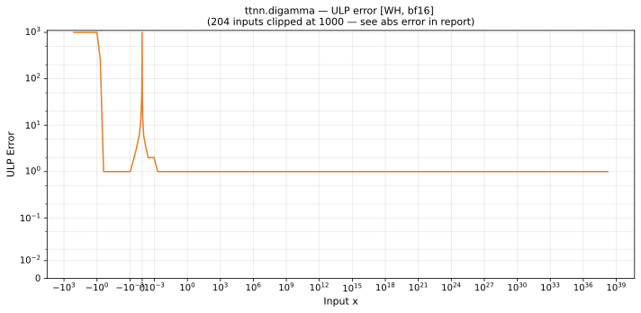

# `digamma` — All Architectures & Dtypes
_This page is auto-generated by `scripts/generate_reports.py`. Do not edit manually._

_Generated: 2026-04-28 10:59 UTC_

[← All ops](../README.md) | [Top](../../README.md)

**Valid domain:** x > 0 (poles at non-positive integers)  

| Variant | Arch | bfloat16 | float32 |
|---------|------||------|------|
| default | Wormhole (WH) | [4.94 ULP](../../by_arch/wh/bf16/digamma.md) | — |

---

## Charts

### Wormhole (WH), bfloat16

