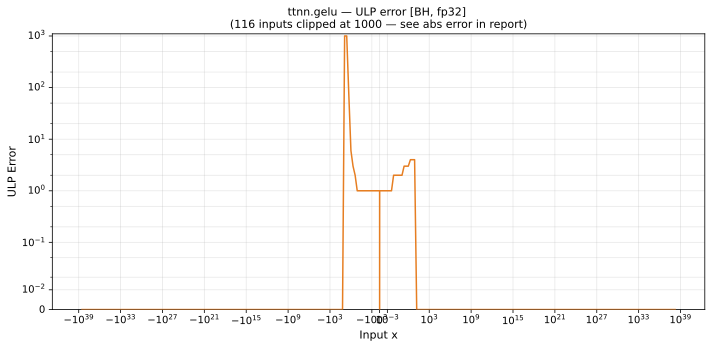
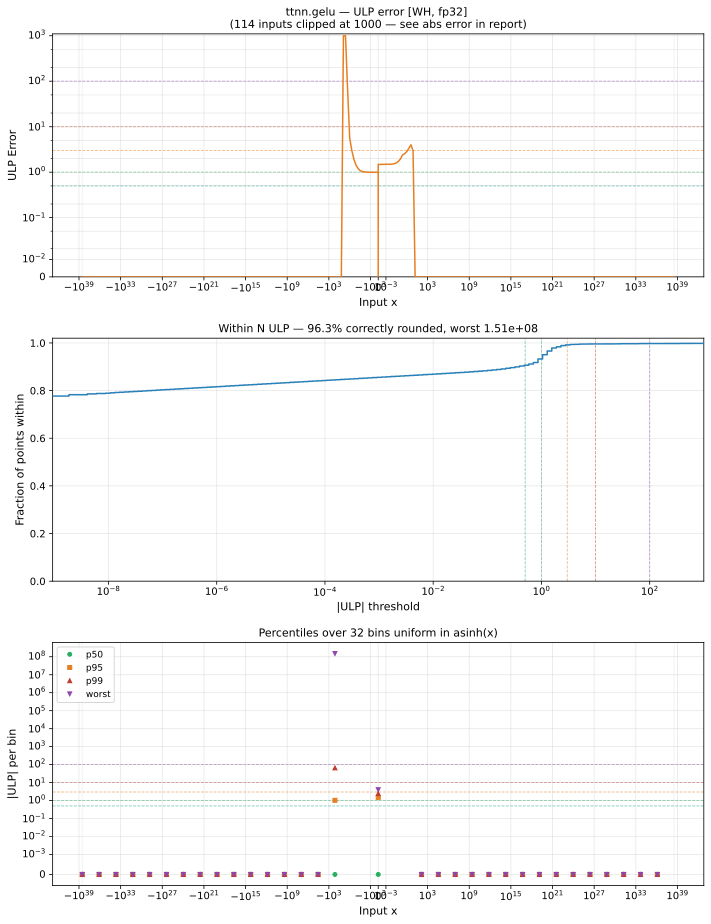
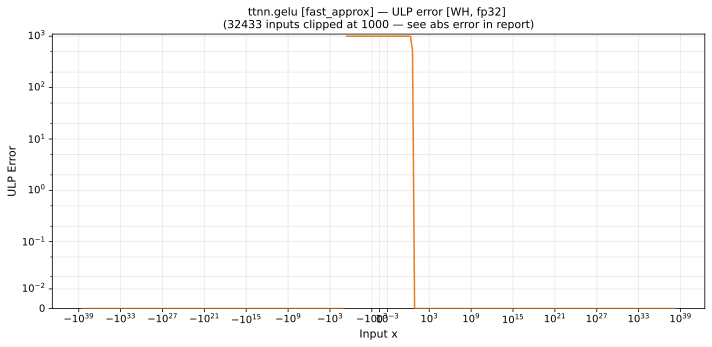

# `gelu` — All Architectures & Data Types
_This page is auto-generated by `ttnn-accuracy report`. Do not edit manually._

_Generated: 2026-09-01 13:48_

[← All ops](../README.md) | [Top](../../README.md)

| Parameters | Arch | bfloat16 | float32 |
|------------|------|------|------|
| `default` | Blackhole (BH) | [165 ULP](../../by_arch/bh/bf16/gelu.md) | [1.71e+08 ULP](../../by_arch/bh/fp32/gelu.md) |
| `default` | Wormhole (WH) | [165 ULP](../../by_arch/wh/bf16/gelu.md) | [1.51e+08 ULP](../../by_arch/wh/fp32/gelu.md) |
| `fast_approx` | Blackhole (BH) | [1.14e+36 ULP](../../by_arch/bh/bf16/gelu.md) | [2.91e+38 ULP](../../by_arch/bh/fp32/gelu.md) |
| `fast_approx` | Wormhole (WH) | [1.14e+36 ULP](../../by_arch/wh/bf16/gelu.md) | [2.91e+38 ULP](../../by_arch/wh/fp32/gelu.md) |

---

## Charts

### Blackhole (BH), bfloat16

**`default`**

**`fast_approx`**

### Blackhole (BH), float32

**`default`**

**`fast_approx`**

### Wormhole (WH), bfloat16

**`default`**

**`fast_approx`**

### Wormhole (WH), float32

**`default`**

**`fast_approx`**

