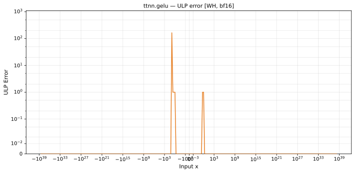
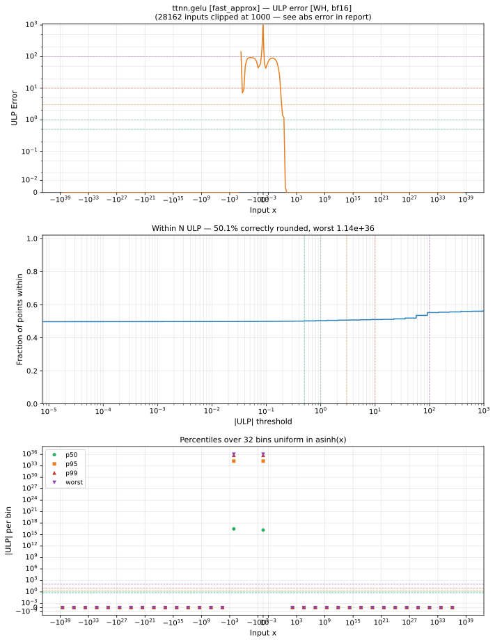

# `gelu` — All Architectures & Data Types
_This page is auto-generated by `scripts/generate_reports.py`. Do not edit manually._

_Generated: 2026-04-28 11:29 UTC_

[← All ops](../README.md) | [Top](../../README.md)

| Parameters | Arch | bfloat16 |
|------------|------|------|
| `default` | Wormhole (WH) | [1.02 ULP](../../by_arch/wh/bf16/gelu.md) |
| `fast_approx` | Wormhole (WH) | [1.14e+36 ULP](../../by_arch/wh/bf16/gelu.md) |

---

## Charts

### Wormhole (WH), bfloat16

**`default`**

**`fast_approx`**

