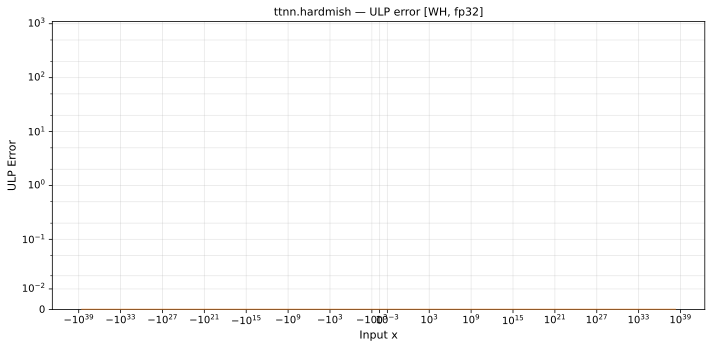

# `hardmish` — All Architectures & Data Types
_This page is auto-generated by `scripts/generate_reports.py`. Do not edit manually._

_Generated: 2026-06-25 19:04 UTC_

[← All ops](../README.md) | [Top](../../README.md)

**Notes:** hardmish: x * clamp(x+2, 0, 2) / 2  

| Parameters | Arch | bfloat16 | float32 |
|------------|------|------|------|
| `default` | Blackhole (BH) | [1 ULP](../../by_arch/bh/bf16/hardmish.md) | [1 ULP](../../by_arch/bh/fp32/hardmish.md) |
| `default` | Wormhole (WH) | [255 ULP](../../by_arch/wh/bf16/hardmish.md) | [1.68e+07 ULP](../../by_arch/wh/fp32/hardmish.md) |

---

## Charts

### Blackhole (BH), bfloat16

**`default`**

### Blackhole (BH), float32

**`default`**

### Wormhole (WH), bfloat16

**`default`**

### Wormhole (WH), float32

**`default`**

