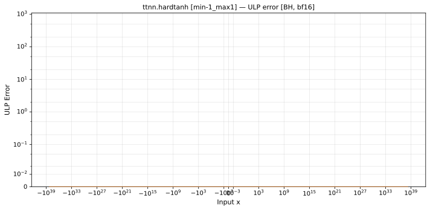
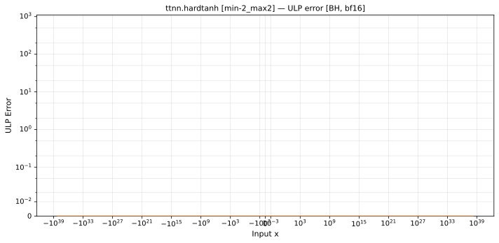
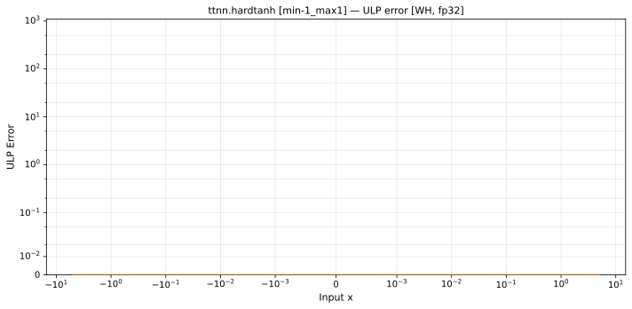

# `hardtanh` — All Architectures & Data Types
_This page is auto-generated by `scripts/generate_reports.py`. Do not edit manually._

_Generated: 2026-04-30 07:30 UTC_

[← All ops](../README.md) | [Top](../../README.md)

| Parameters | Arch | bfloat16 | float32 |
|------------|------|------|------|
| `min=-1,max=1` | Blackhole (BH) | [0 ULP](../../by_arch/bh/bf16/hardtanh.md) | — |
| `min=-1,max=1` | Wormhole (WH) | [0 ULP](../../by_arch/wh/bf16/hardtanh.md) | [0 ULP](../../by_arch/wh/fp32/hardtanh.md) |
| `min=-2,max=2` | Blackhole (BH) | [0 ULP](../../by_arch/bh/bf16/hardtanh.md) | — |
| `min=-2,max=2` | Wormhole (WH) | [0 ULP](../../by_arch/wh/bf16/hardtanh.md) | [0 ULP](../../by_arch/wh/fp32/hardtanh.md) |

---

## Charts

### Blackhole (BH), bfloat16

**`min=-1,max=1`**

**`min=-2,max=2`**

### Wormhole (WH), bfloat16

**`min=-1,max=1`**

**`min=-2,max=2`**

### Wormhole (WH), float32

**`min=-1,max=1`**

**`min=-2,max=2`**

