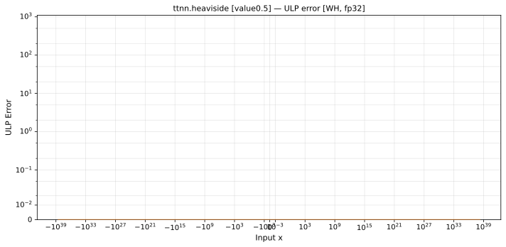

# `heaviside` — All Architectures & Data Types
_This page is auto-generated by `ttnn-accuracy report`. Do not edit manually._

_Generated: 2026-08-31 09:14_

[← All ops](../README.md) | [Top](../../README.md)

| Parameters | Arch | bfloat16 | float32 |
|------------|------|------|------|
| `value=0.5` | Wormhole (WH) | [0 ULP](../../by_arch/wh/bf16/heaviside.md) | [0 ULP](../../by_arch/wh/fp32/heaviside.md) |

---

## Charts

### Wormhole (WH), bfloat16

**`value=0.5`**

### Wormhole (WH), float32

**`value=0.5`**

