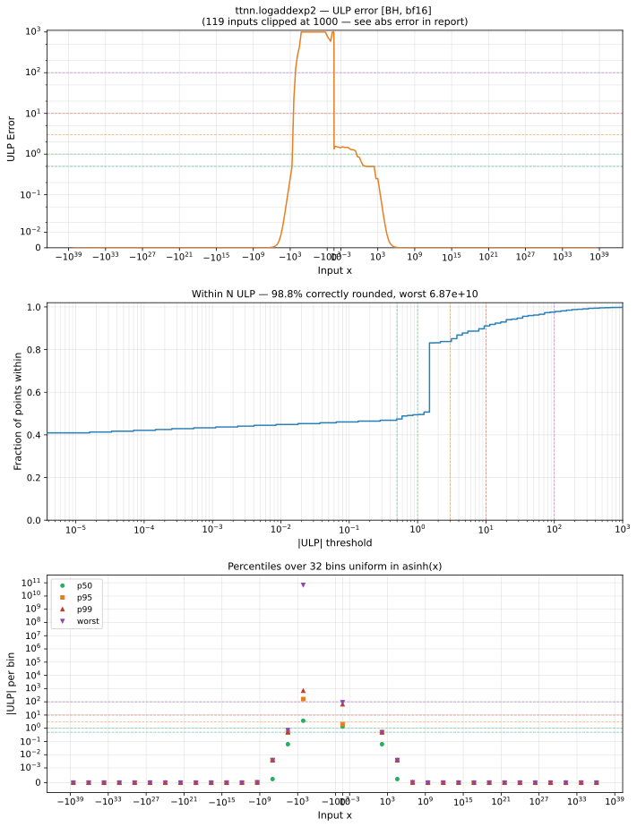

# `logaddexp2` — All Architectures & Data Types
_This page is auto-generated by `ttnn-accuracy report`. Do not edit manually._

[← All ops](../README.md) | [Top](../../README.md)

| Parameters | Arch | bfloat16 | float32 |
|------------|------|------|------|
| `default` | Blackhole (BH) | [6.87e+10 ULP](../../by_arch/bh/bf16/logaddexp2.md) | [1.06e+07 ULP](../../by_arch/bh/fp32/logaddexp2.md) |

---

## Charts

### Blackhole (BH), bfloat16

**`default`**

### Blackhole (BH), float32

**`default`**

