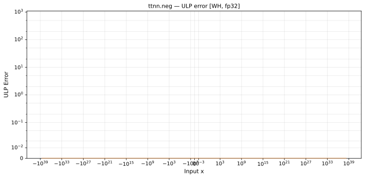

# `neg` — All Architectures & Data Types
_This page is auto-generated by `ttnn-accuracy report`. Do not edit manually._

_Generated: 2026-08-31 08:09_

[← All ops](../README.md) | [Top](../../README.md)

| Parameters | Arch | bfloat16 | float32 |
|------------|------|------|------|
| `default` | Wormhole (WH) | [0 ULP](../../by_arch/wh/bf16/neg.md) | [0 ULP](../../by_arch/wh/fp32/neg.md) |

---

## Charts

### Wormhole (WH), bfloat16

**`default`**

### Wormhole (WH), float32

**`default`**

