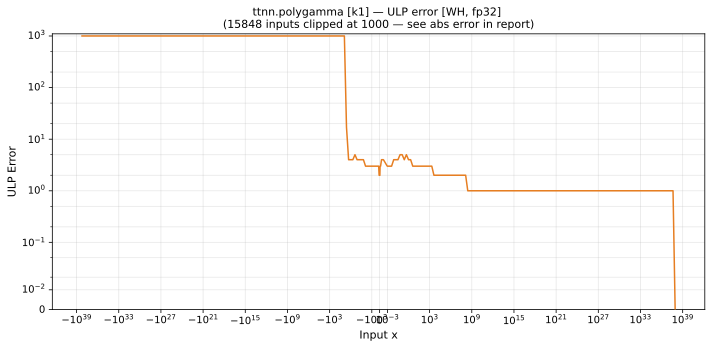
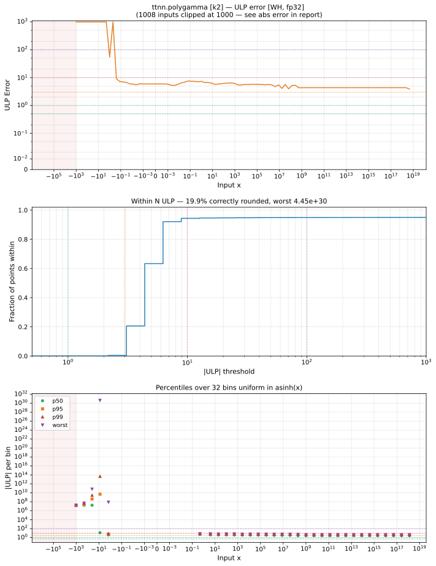
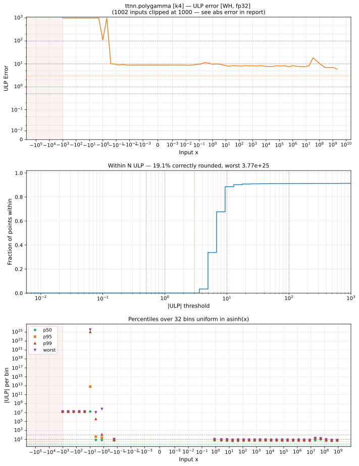

# `polygamma` — All Architectures & Data Types
_This page is auto-generated by `ttnn-accuracy report`. Do not edit manually._

[← All ops](../README.md) | [Top](../../README.md)

| Parameters | Arch | bfloat16 | float32 |
|------------|------|------|------|
| `k=1` | Blackhole (BH) | [1.02e+08 ULP](../../by_arch/bh/bf16/polygamma.md) | [7.91e+33 ULP](../../by_arch/bh/fp32/polygamma.md) |
| `k=1` | Wormhole (WH) | [1.02e+08 ULP](../../by_arch/wh/bf16/polygamma.md) | [7.91e+33 ULP](../../by_arch/wh/fp32/polygamma.md) |
| `k=2` | Blackhole (BH) | — | — |
| `k=2` | Wormhole (WH) | [3.57e+08 ULP](../../by_arch/wh/bf16/polygamma.md) | [4.45e+30 ULP](../../by_arch/wh/fp32/polygamma.md) |
| `k=4` | Blackhole (BH) | — | — |
| `k=4` | Wormhole (WH) | [3.22e+09 ULP](../../by_arch/wh/bf16/polygamma.md) | [3.77e+25 ULP](../../by_arch/wh/fp32/polygamma.md) |

---

## Charts

### Blackhole (BH), bfloat16

**`k=1`**

### Blackhole (BH), float32

**`k=1`**

### Wormhole (WH), bfloat16

**`k=1`**

**`k=2`**

**`k=4`**

### Wormhole (WH), float32

**`k=1`**

**`k=2`**

**`k=4`**

