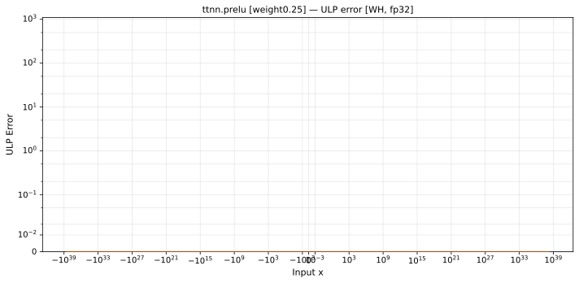

# `prelu` — All Architectures & Data Types
_This page is auto-generated by `ttnn-accuracy report`. Do not edit manually._

_Generated: 2026-09-02 14:00_

[← All ops](../README.md) | [Top](../../README.md)

| Parameters | Arch | bfloat16 | float32 |
|------------|------|------|------|
| `weight=0.25` | Blackhole (BH) | [0 ULP](../../by_arch/bh/bf16/prelu.md) | [0 ULP](../../by_arch/bh/fp32/prelu.md) |
| `weight=0.25` | Wormhole (WH) | [0 ULP](../../by_arch/wh/bf16/prelu.md) | [0 ULP](../../by_arch/wh/fp32/prelu.md) |

---

## Charts

### Blackhole (BH), bfloat16

**`weight=0.25`**

### Blackhole (BH), float32

**`weight=0.25`**

### Wormhole (WH), bfloat16

**`weight=0.25`**

### Wormhole (WH), float32

**`weight=0.25`**

