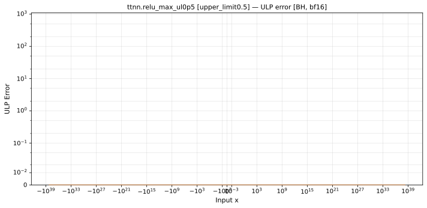
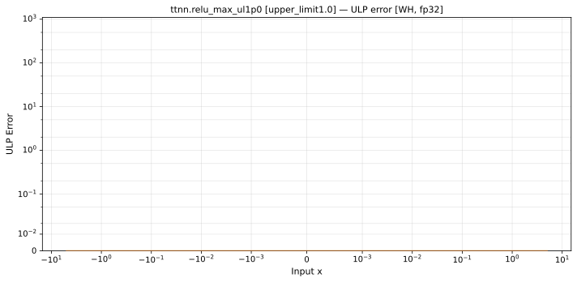

# `relu_max` — All Architectures & Data Types
_This page is auto-generated by `scripts/generate_reports.py`. Do not edit manually._

_Generated: 2026-06-25 19:04 UTC_

[← All ops](../README.md) | [Top](../../README.md)

**Notes:** relu_max upper_limit=0.5  

| Parameters | Arch | bfloat16 | float32 |
|------------|------|------|------|
| `upper_limit=0.5` | Blackhole (BH) | [0 ULP](../../by_arch/bh/bf16/relu_max.md) | [0 ULP](../../by_arch/bh/fp32/relu_max.md) |
| `upper_limit=0.5` | Wormhole (WH) | [0 ULP](../../by_arch/wh/bf16/relu_max.md) | [0 ULP](../../by_arch/wh/fp32/relu_max.md) |
| `upper_limit=1.0` | Blackhole (BH) | [0 ULP](../../by_arch/bh/bf16/relu_max.md) | [0 ULP](../../by_arch/bh/fp32/relu_max.md) |
| `upper_limit=1.0` | Wormhole (WH) | [0 ULP](../../by_arch/wh/bf16/relu_max.md) | [0 ULP](../../by_arch/wh/fp32/relu_max.md) |
| `upper_limit=2.0` | Blackhole (BH) | [0 ULP](../../by_arch/bh/bf16/relu_max.md) | [0 ULP](../../by_arch/bh/fp32/relu_max.md) |
| `upper_limit=2.0` | Wormhole (WH) | [0 ULP](../../by_arch/wh/bf16/relu_max.md) | [0 ULP](../../by_arch/wh/fp32/relu_max.md) |

---

## Charts

### Blackhole (BH), bfloat16

**`upper_limit=0.5`**

**`upper_limit=1.0`**

**`upper_limit=2.0`**

### Blackhole (BH), float32

**`upper_limit=0.5`**

**`upper_limit=1.0`**

**`upper_limit=2.0`**

### Wormhole (WH), bfloat16

**`upper_limit=0.5`**

**`upper_limit=1.0`**

**`upper_limit=2.0`**

### Wormhole (WH), float32

**`upper_limit=0.5`**

**`upper_limit=1.0`**

**`upper_limit=2.0`**

