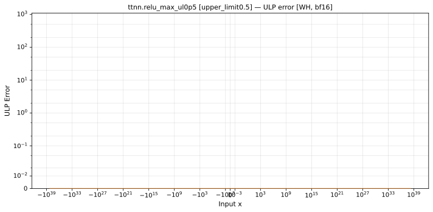

# `relu_max` — All Architectures & Dtypes
_This page is auto-generated by `scripts/generate_reports.py`. Do not edit manually._

_Generated: 2026-04-28 10:05 UTC_

[← All ops](../README.md) | [Top](../../README.md)

**Notes:** relu_max upper_limit=0.5  

| Variant | Arch | bfloat16 | float32 |
|---------|------||------|------|
| upper_limit0.5 | Wormhole (WH) | [0 ULP](../../by_arch/wh/bf16/relu_max_ul0p5.md) | — |

---

## Charts

### Wormhole (WH), bfloat16

