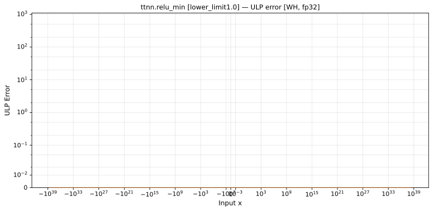

# `relu_min` — All Architectures & Data Types
_This page is auto-generated by `ttnn-accuracy report`. Do not edit manually._

[← All ops](../README.md) | [Top](../../README.md)

| Parameters | Arch | bfloat16 | float32 |
|------------|------|------|------|
| `lower_limit=1.0` | Blackhole (BH) | [0 ULP](../../by_arch/bh/bf16/relu_min.md) | [0 ULP](../../by_arch/bh/fp32/relu_min.md) |
| `lower_limit=1.0` | Wormhole (WH) | [0 ULP](../../by_arch/wh/bf16/relu_min.md) | [0 ULP](../../by_arch/wh/fp32/relu_min.md) |

---

## Charts

### Blackhole (BH), bfloat16

**`lower_limit=1.0`**

### Blackhole (BH), float32

**`lower_limit=1.0`**

### Wormhole (WH), bfloat16

**`lower_limit=1.0`**

### Wormhole (WH), float32

**`lower_limit=1.0`**

