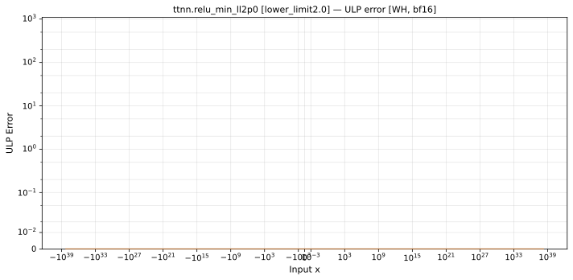

# `relu_min` — All Architectures & Dtypes
_This page is auto-generated by `scripts/generate_reports.py`. Do not edit manually._

_Generated: 2026-04-27 14:02 UTC_

[← All ops](../README.md) | [Top](../../README.md)

**Notes:** relu_min lower_limit=2.0  

| Variant | Arch | bfloat16 | float32 |
|---------|------||------|------|
| lower_limit2.0 | Wormhole (WH) | [0 ULP](../../by_arch/wh/bf16/relu_min_ll2p0.md) | — |

---

## Charts

### Wormhole (WH), bfloat16

