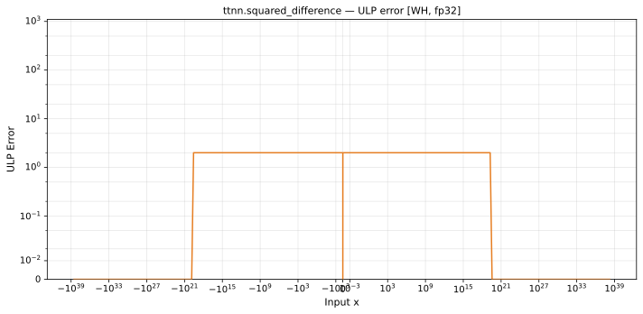

# `squared_difference` — All Architectures & Data Types
_This page is auto-generated by `ttnn-accuracy report`. Do not edit manually._

[← All ops](../README.md) | [Top](../../README.md)

| Parameters | Arch | bfloat16 | float32 |
|------------|------|------|------|
| `default` | Blackhole (BH) | [2.03 ULP](../../by_arch/bh/bf16/squared_difference.md) | [1.91 ULP](../../by_arch/bh/fp32/squared_difference.md) |
| `default` | Wormhole (WH) | [2.03 ULP](../../by_arch/wh/bf16/squared_difference.md) | [1.91 ULP](../../by_arch/wh/fp32/squared_difference.md) |

---

## Charts

### Blackhole (BH), bfloat16

**`default`**

### Blackhole (BH), float32

**`default`**

### Wormhole (WH), bfloat16

**`default`**

### Wormhole (WH), float32

**`default`**

