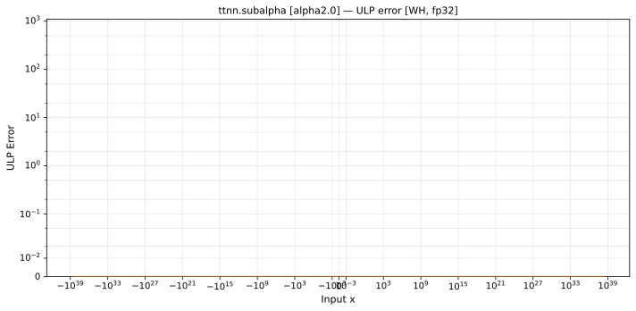

# `subalpha` — All Architectures & Data Types
_This page is auto-generated by `ttnn-accuracy report`. Do not edit manually._

_Generated: 2026-08-31 09:14_

[← All ops](../README.md) | [Top](../../README.md)

| Parameters | Arch | bfloat16 | float32 |
|------------|------|------|------|
| `alpha=2.0` | Wormhole (WH) | [254 ULP](../../by_arch/wh/bf16/subalpha.md) | [0 ULP](../../by_arch/wh/fp32/subalpha.md) |

---

## Charts

### Wormhole (WH), bfloat16

**`alpha=2.0`**

### Wormhole (WH), float32

**`alpha=2.0`**

