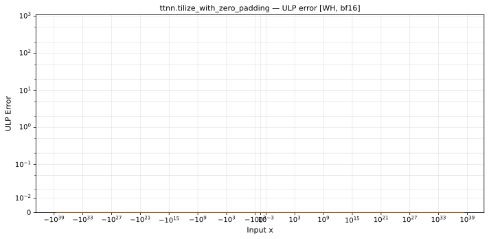

# `tilize_with_zero_padding` — All Architectures & Data Types
_This page is auto-generated by `ttnn-accuracy report`. Do not edit manually._

_Generated: 2026-08-27 13:13_

[← All ops](../README.md) | [Top](../../README.md)

| Parameters | Arch | bfloat16 |
|------------|------|------|
| `default` | Wormhole (WH) | [0 ULP](../../by_arch/wh/bf16/tilize_with_zero_padding.md) |

---

## Charts

### Wormhole (WH), bfloat16

**`default`**

