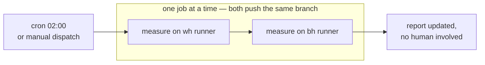
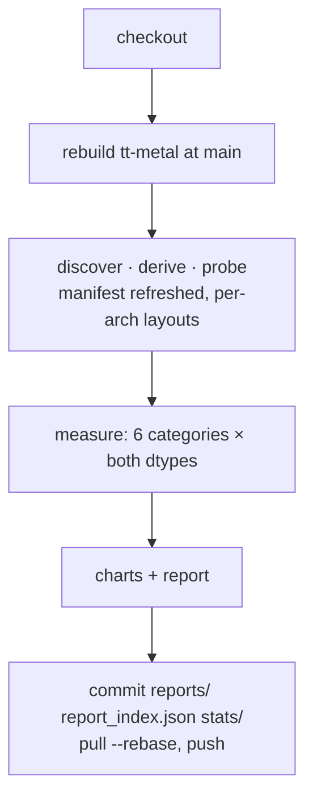
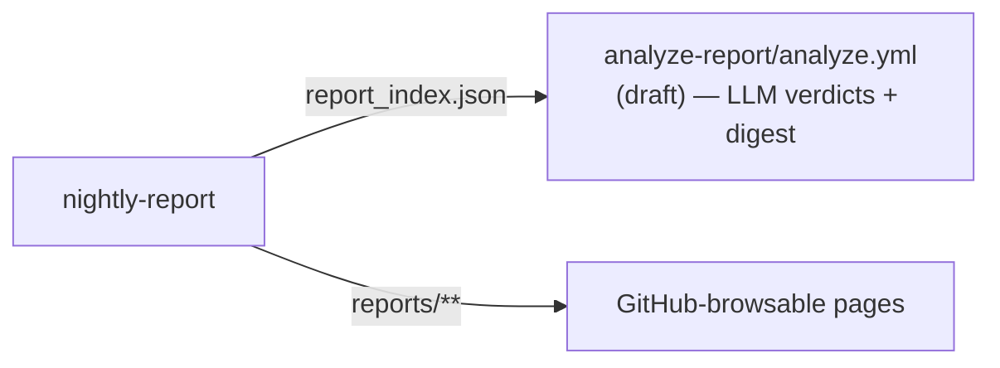

# Nightly report workflow

[nightly-report.yml](nightly-report.yml) — the epic's no-human-intervention bullet.
Inert here; it runs once copied to `.github/workflows/` on a repo with self-hosted
TT runners labelled `wh` and `bh`.

## One night

## One job

| Property | Choice |
|---|---|
| trigger | nightly cron + `workflow_dispatch` |
| runners | `[self-hosted, wh]` / `[self-hosted, bh]`, matrix `max-parallel: 1` |
| tt-metal version | whatever `main` is that night — recorded per run in `stats/runs/` |
| gate | none — regenerate and publish; `compare` exists as a manual tool |
| runner provides | `TT_METAL_HOME` (built checkout), `PYTHON_ENV` |
| timeout | 12 h per arch |

## After it lands

